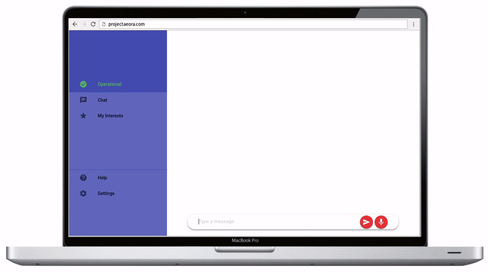

# Aeora

**The ChatBot for traders, providing answers to questions on the FTSE 100.   
Built for quick and intellectual conversations.**

## Installation
Install all the dependencies using the command:

    pip3 install -r requirements.txt

This is a Django project therefore the command you need to run it is:

    python3 manage.py runserver
